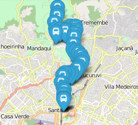

# GTFS Visualizer []
(https://codeclimate.com/github/AndreNDarcie/gtfs-visualizer) [](https://codeclimate.com/github/AndreNDarcie/gtfs-visualizer)

*Data viewer for gtfs*

:bus: Library responsible for generating HTML data based on the GTFS format.

## GTFS Overview

  The General Transit Feed Specification (GTFS), also known as GTFS static or static transit to differentiate it from the GTFS realtime extension, defines a common format for public transportation schedules and associated geographic information. GTFS "feeds" let public transit agencies publish their transit data and developers write applications that consume that data in an interoperable way. *(from google developers)*

  Read more about [here](https://developers.google.com/transit/gtfs/).

## Getting started

  Include the following javascript in your html
  ```html
  <script src="js/icons.js"></script>
  <script src="js/generator.js"></script>
  <script src="js/get-api.js"></script>
  ```
  *under construction*

## Library Functions
### Agencies
  - **Draw Agency Stop**: Draws a stop on the map, with the position and agency name.

  ```javascript
    Generator.drawAgencyStop(data);
  ```

  - **Draw Agency Popup**: Draws a popup on the stop, with the agency's information.

  ```javascript
    Generator.drawAgencyPopup(data);
  ```

### Routes
  - **Draw Routes**: Generates the HTML code a list of routes.

  ```javascript
    Generator.drawRoutes(data);
  ```

  - **Draw Shapes**: Draws on the map a line between the points of shape.

  ```javascript
    Generator.drawShapes(data);
  ```

## Example
| Before        | After         |
| ------------- |:-------------:|
|  |  |


